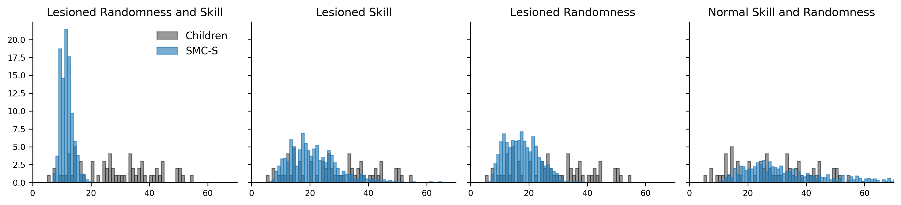
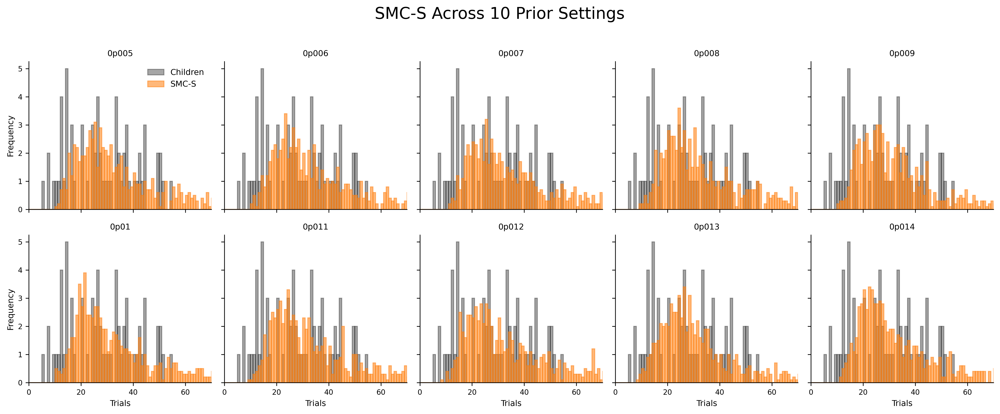
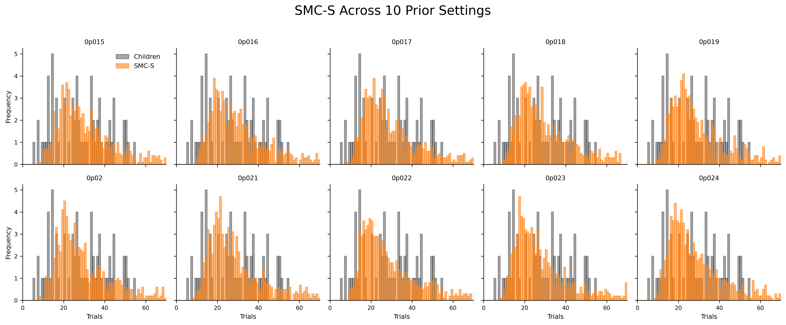

## SMC-S Results Update 

### 1. Four Main SMC-S Settings (CCN Panels)

I ran the four core configurations corresponding to the CCN panels:

- `theta_19_1__gen_0p01__priororder_0p05__`
- `theta_2_2__gen_0p01__priororder_0p05__`
- `theta_19_1__gen_0p6__priororder_0p05__`
- `theta_2_2__gen_0p6__priororder_0p01__`

These reproduce the expected qualitative patterns across:
- high vs low skill (theta)
- low vs high randomness (generator prior)

---

### 2. Prior Sweep Experiments

To investigate sensitivity to the true rule prior, I fixed:

- `theta = (2,2)` (lower skill)  
- `prop_random = 0.6`  

and ran two sweeps:

- `prior_order ∈ [0.005, 0.014]` (10 values)  
- `prior_order ∈ [0.015, 0.024]` (10 values)  

Across these 20 experiments, there is no significant improvement in fitting to the children’s data.

---

### 3. using IG softmax log licklihood Fitting result as the best case the SMC sampler can do to simulate children behaviour

I still cannot resolve the mathematical issue in the information gain log-likelihood fitting, and I will prepare a clearer explanation to discuss maybe during the group meeting.